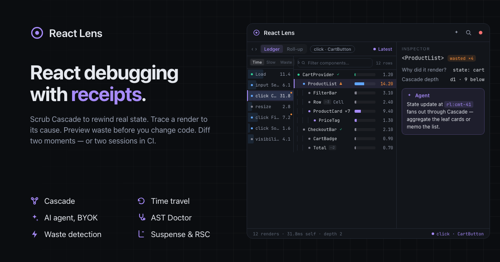

<p align="center">
  
</p>

<h1 align="center">React Lens</h1>

<p align="center">
  <strong>React debugging with receipts.</strong><br />
  Scrub Cascade to rewind real state. Trace a render to its cause. Preview waste
  before you change code. Diff two moments — or two sessions in CI. Human or AI
  agent — every answer cites the exact render, component, and line.
</p>

<p align="center">
  <a href="LICENSE"></a>
  
  
</p>

---

The debugging platform for React — built for humans and AI agents, with proof.
Every click, commit, and render lands in one event log, so answers are backed
by evidence instead of guesses.

## Features

- **Cascade** — the center of the panel: a causal render graph for the selected
  interaction. Depth left→right, ordered edges, Fit / 1:1, focus modes (All /
  Expensive / Roots), Cause / Effects, aggregated leaf fan-out, and a minimap.
  Replay and time-travel controls live on the same toolbar.
- **Time travel** — scrub or replay an interaction and (in dev builds) restore
  real page state as you go: raw `useState` / `useReducer` / class state, put
  back through React's own override API. Follow **Latest** or step previous /
  next interaction.
- **AI agent, BYOK** — ⌘I opens an in-panel assistant (OpenAI / Anthropic /
  Z.AI; your key never leaves the browser) that answers through typed tools
  over the live trace. Every claim cites a Lens ID — clickable chips that jump
  to the exact render, component, or interaction.
- **Render causes** — why-did-this-render at three levels of depth, with
  confidence levels and a "no observable change" verdict when a render was
  avoidable.
- **Diffs, per render and across time** — value + DOM diffs for one commit;
  A/B any two commits for a whole-app index of what ended up different.
- **Pick it, find it** — ⌘\\ picks an element on the page and selects it in the
  tree; selecting in the panel outlines it and scrolls off-screen targets into
  view (so ↑/↓ doesn't drag the app around).
- **Inspector** — props, state, hooks, DOM, and source for the selection, with
  live edit through the dev renderer.
- **Replay with fix** — preview the panel tree with wasted renders hidden.
  Fix with AI opens the BYOK agent on a Doctor finding; it proposes a patch and
  does not write to disk.
- **AST Doctor** — static analysis (OXC when available, regex fallback in the
  panel) fused with runtime evidence; findings are scoped to a component's
  definition and stamped `file:line`.
- **Waste detection** — after an interaction settles, a banner flags renders
  that produced no visible change and jumps you to the worst offender.
- **Explain this interaction** — one click produces a ranked narrative: cost,
  cause chain, Doctor findings, suggested next step.
- **Effect debugger** — timed effect run/cleanup events, durations, and a
  "possible loop" badge when an effect fires on nearly every render.
- **Suspense & RSC aware** — suspense boundaries, server-component roles, and
  server actions are detected from client fiber heuristics and badged in the
  tree and inspector.
- **Sessions** — export/import the whole trace as a `.json` file; recent
  sessions persist in IndexedDB and reload from ⌘K.
- **React 19 + Compiler aware** — compiled components are badged ✓;
  compiler bailouts are first-class evidence. Recommendations stay
  evidence-backed (including memo when the data supports it).

### Agents, CLI, and CI

- **CLI** — `react-lens analyze` turns a session file into a markdown report;
  `react-lens ci` compares baseline vs actual session files (paired by filename)
  for regressions.
- **MCP** — `react-lens mcp` exposes the same 23 typed tools over stdio so
  Cursor, Claude, or any MCP host can diagnose from a session file.
- **Playwright verify** — name interactions in tests, export sessions, and
  `compare_sessions` (or `react-lens ci`) before vs after a fix.
- **Session files** — portable v1 JSON: export from the panel, analyze
  headlessly, hand to an agent. See [docs/sessions.md](docs/sessions.md).

## Quick start

Requires Node ≥ 20 and [pnpm](https://pnpm.io). Full walkthrough:
[docs/getting-started.md](docs/getting-started.md). Live demo:
[reactlens.xyz](https://www.reactlens.xyz/).

```bash
pnpm install
```

### Try it in the playground (no extension needed)

```bash
pnpm dev:playground
```

Open the page and click a product in the Shop. The in-page panel records the
interaction on **Cascade**, flags avoidable re-renders, and can **Explain** the
cost.

### Chrome extension

```bash
pnpm build:extension
```

Load `apps/extension/dist` as an unpacked extension (`chrome://extensions` →
Developer mode → Load unpacked), then open DevTools → **React Lens**.

### The site (inspects itself)

```bash
pnpm dev:site
```

The product site runs Lens on its own component tree — everything in the
panel is the page you're looking at.

## For agents

Same tools the panel agent uses, over a session file:

```bash
pnpm react-lens analyze path/to/session.json
pnpm react-lens mcp --session path/to/session.json
pnpm react-lens ci --baseline ./baselines --actual ./actual
```

- [docs/cli.md](docs/cli.md) — analyze + CI flags
- [docs/mcp.md](docs/mcp.md) — MCP setup and tool catalog
- [packages/mcp/AGENTS.md](packages/mcp/AGENTS.md) — symptom → tool playbook
- [docs/verify.md](docs/verify.md) — Playwright + named interactions

## How it works

A pure analysis core — plain data in, plain data out, zero framework
dependencies — sits behind a small page-side capture half, bridged by a shared
protocol. Dependencies flow one way; the panel is just a consumer of the
event log.

```
packages/
  protocol/         shared event + message + session contract
  serializer/       safe value serialization (never throws)
  diff-engine/      value + DOM diff
  trace-engine/     event log, queries, subscriptions
  causality/        why-did-this-render + verdicts
  fiber/            owned React hook, DOM ↔ fiber resolution
  instrumentation/  commits + interactions → events
  diagnostics/      Doctor rules (runtime + static AST)
  explain/          deterministic interaction narratives
  agent/            trace-grounded tool loop, BYOK providers
  agent-tools/      shared tool handlers (panel, CLI, MCP)
  cli/              analyze · mcp · ci
  mcp/              stdio MCP server + AGENTS.md playbook
  playwright/       named-interaction helpers for the verify loop
  dev-channel/      live WebSocket frame sink + Vite plugin
  source-maps/      runtime component ↔ original source
  tree/ graph/      semantic tree + graph projections
  ui/ icons/        shared panel primitives
  demo-ui/          shared demo primitives (playground / e2e)
apps/
  devtools/         the React 19 panel (Cascade + redesign shell)
  playground/       demo app engineered to misbehave
  extension/        MV3 Chrome extension shell
  site/             product site (inspects itself)
  e2e-fixture/      Playwright / CI fixture app
```

User guides live in [docs/](docs/). Architecture:
[DESIGN.md](DESIGN.md). Package contracts: [INTERFACES.md](INTERFACES.md).

## Status

The core is demoable end-to-end: fiber capture, semantic tree, inspector,
**Cascade** with time travel and replay transport, Explain, Doctor, the AI
agent, sessions, CLI/MCP, the verify loop, and the extension shell.
[ROADMAP.md](ROADMAP.md) is the living checklist of what's built and what's
next.

Not yet: Firefox/Safari extensions, network adapters.

## Contributing

Issues and PRs are welcome.

```bash
pnpm install
pnpm test             # vitest across all packages
pnpm typecheck        # strict tsc -b
pnpm dev:playground   # fastest feedback loop
```

A few ground rules:

- Keep the core pure — `trace-engine` / `diff-engine` / `causality` take
  plain data and return plain data; framework coupling stays in the adapter
  layers.
- Match the existing TypeScript and UI patterns in `apps/devtools`.
- Tests first: pure logic gets plain unit tests, integration behavior gets a
  contract test against real React 19.

## License

[MIT](LICENSE)
